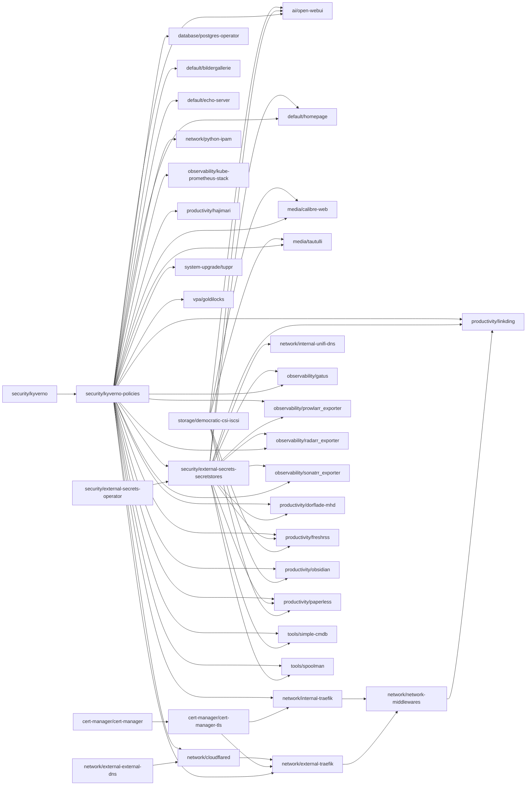

# Flux Kustomization Dependency Graph

This document visualizes the dependencies between Flux Kustomizations in the cluster.

**Last Updated:** $(date -u +"%Y-%m-%d %H:%M:%S UTC")

## Dependency Graph

```mermaid
flowchart LR

    %% Node definitions
    ai_open_webui["ai/open-webui"]
    cert_manager_cert_manager["cert-manager/cert-manager"]
    cert_manager_cert_manager_tls["cert-manager/cert-manager-tls"]
    database_postgres_operator["database/postgres-operator"]
    default_bildergallerie["default/bildergallerie"]
    default_echo_server["default/echo-server"]
    default_homepage["default/homepage"]
    media_calibre_web["media/calibre-web"]
    media_tautulli["media/tautulli"]
    network_cloudflared["network/cloudflared"]
    network_external_external_dns["network/external-external-dns"]
    network_external_traefik["network/external-traefik"]
    network_internal_traefik["network/internal-traefik"]
    network_internal_unifi_dns["network/internal-unifi-dns"]
    network_network_middlewares["network/network-middlewares"]
    network_python_ipam["network/python-ipam"]
    observability_gatus["observability/gatus"]
    observability_kube_prometheus_stack["observability/kube-prometheus-stack"]
    observability_prowlarr_exporter["observability/prowlarr_exporter"]
    observability_radarr_exporter["observability/radarr_exporter"]
    observability_sonatrr_exporter["observability/sonatrr_exporter"]
    productivity_dorflade_mhd["productivity/dorflade-mhd"]
    productivity_freshrss["productivity/freshrss"]
    productivity_hajimari["productivity/hajimari"]
    productivity_linkding["productivity/linkding"]
    productivity_obsidian["productivity/obsidian"]
    productivity_paperless["productivity/paperless"]
    security_external_secrets_operator["security/external-secrets-operator"]
    security_external_secrets_secretstores["security/external-secrets-secretstores"]
    security_kyverno["security/kyverno"]
    security_kyverno_policies["security/kyverno-policies"]
    storage_democratic_csi_iscsi["storage/democratic-csi-iscsi"]
    system_upgrade_tuppr["system-upgrade/tuppr"]
    tools_simple_cmdb["tools/simple-cmdb"]
    tools_spoolman["tools/spoolman"]
    vpa_goldilocks["vpa/goldilocks"]

    %% Dependencies
    security_external_secrets_secretstores --> network_internal_unifi_dns
    security_external_secrets_secretstores --> observability_sonatrr_exporter
    security_kyverno_policies --> observability_kube_prometheus_stack
    security_kyverno_policies --> observability_sonatrr_exporter
    security_kyverno_policies --> network_python_ipam
    storage_democratic_csi_iscsi --> ai_open_webui
    security_kyverno_policies --> productivity_paperless
    security_kyverno_policies --> tools_simple_cmdb
    security_kyverno_policies --> database_postgres_operator
    security_kyverno_policies --> productivity_linkding
    security_kyverno_policies --> productivity_obsidian
    network_cloudflared --> network_external_traefik
    security_external_secrets_secretstores --> default_homepage
    security_kyverno_policies --> network_internal_traefik
    security_kyverno_policies --> observability_prowlarr_exporter
    security_kyverno_policies --> tools_spoolman
    security_kyverno_policies --> productivity_freshrss
    security_kyverno_policies --> vpa_goldilocks
    security_kyverno_policies --> security_external_secrets_secretstores
    security_kyverno_policies --> default_echo_server
    cert_manager_cert_manager_tls --> network_external_traefik
    security_external_secrets_secretstores --> tools_spoolman
    security_external_secrets_secretstores --> productivity_linkding
    security_kyverno_policies --> network_external_traefik
    cert_manager_cert_manager --> cert_manager_cert_manager_tls
    security_external_secrets_secretstores --> ai_open_webui
    storage_democratic_csi_iscsi --> media_calibre_web
    security_external_secrets_secretstores --> observability_prowlarr_exporter
    security_kyverno_policies --> default_bildergallerie
    storage_democratic_csi_iscsi --> productivity_obsidian
    network_internal_traefik --> network_network_middlewares
    security_external_secrets_operator --> security_external_secrets_secretstores
    network_external_traefik --> network_network_middlewares
    security_kyverno_policies --> ai_open_webui
    security_kyverno_policies --> network_cloudflared
    security_external_secrets_secretstores --> productivity_paperless
    security_kyverno_policies --> productivity_hajimari
    security_kyverno_policies --> productivity_dorflade_mhd
    security_kyverno_policies --> system_upgrade_tuppr
    security_kyverno_policies --> media_calibre_web
    security_external_secrets_secretstores --> observability_gatus
    security_kyverno_policies --> observability_gatus
    network_network_middlewares --> productivity_linkding
    security_external_secrets_secretstores --> observability_radarr_exporter
    security_external_secrets_secretstores --> productivity_freshrss
    security_kyverno_policies --> default_homepage
    network_external_external_dns --> network_cloudflared
    storage_democratic_csi_iscsi --> media_tautulli
    cert_manager_cert_manager_tls --> network_internal_traefik
    security_external_secrets_secretstores --> productivity_dorflade_mhd
    security_kyverno --> security_kyverno_policies
    security_kyverno_policies --> observability_radarr_exporter
    security_external_secrets_secretstores --> tools_simple_cmdb
    storage_democratic_csi_iscsi --> productivity_freshrss
    storage_democratic_csi_iscsi --> productivity_paperless
    security_kyverno_policies --> media_tautulli
```

## Legend

- **Nodes**: Flux Kustomizations (labeled with namespace/name)
- **Arrows**: Dependency relationships (A --> B means B depends on A)

## Statistics

- **Total Kustomizations**: 50
- **Kustomizations with Dependencies**: 36
- **Total Dependencies**: 57

## Common Dependency Targets

The most common dependencies across all Kustomizations:

| Dependency | Dependent Count |
|------------|-----------------|
| `security/kyverno-policies` | 27 |
| `security/external-secrets-secretstores` | 13 |
| `storage/democratic-csi-iscsi` | 6 |
| `cert-manager/cert-manager-tls` | 2 |
| `security/kyverno` | 1 |
| `security/external-secrets-operator` | 1 |
| `network/network-middlewares` | 1 |
| `network/internal-traefik` | 1 |
| `network/external-traefik` | 1 |
| `network/external-external-dns` | 1 |

---

*This graph is automatically generated by `scripts/generate-flux-dependency-graph.sh`*

*To regenerate: `./scripts/generate-flux-dependency-graph.sh`*
